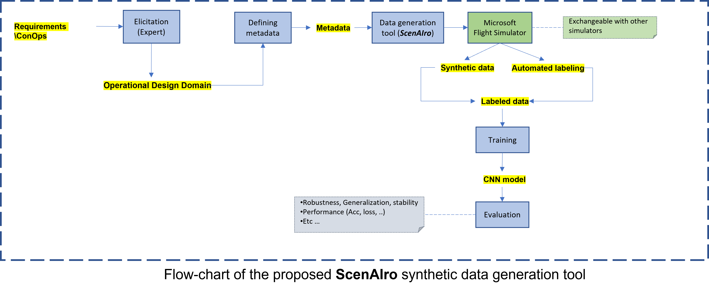
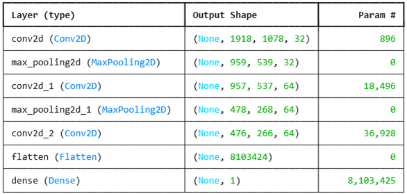

# ScenAIro: An End-to-End Synthetic Data Generation Tool

ScenAIro is a powerful end-to-end tool designed to generate high-fidelity synthetic datasets based on a given Operational Design Domain (ODD). It features high-precision automatic labeling, demonstrated through the use case of an AI-driven runway detection system. The flexible architecture allows integration with various flight simulation systems, enabling adaptability to different environments and requirements.
The implemented toolchain systematically controls three key dimensions of dataset generation for runway identification:

1. **Environmental Conditions**: Adjustable weather parameters such as fog, snow, cloud cover, night landings, and sun glare to reflect diverse operational scenarios.
2. **Aircraft positioning and trajectory**: Precise control over the aircraft’s spatial positioning relative to the runway, as well as its approach trajectory, altitude, bank angle, and pitch, to simulate diverse flight conditions and maneuver variations.
3. **Variable distribution of data points**: Controlled distribution of image capture points in space, ensuring balanced dataset coverage across different perspectives and operational conditions.

By structuring data generation around these configurable parameters, ScenAIro enables a scalable, customizable, and highly diverse dataset, ensuring that both standard operations and critical edge cases are systematically represented for robust AI model training and validation.

## Integration and Automation
Currently, the toolchain leverages Microsoft Flight Simulator (MFS) in an adapted way, utilizing its detailed simulation capabilities to generate high-resolution images. To ensure the accuracy and robustness of fully automated, high-precision labeling, external geospatial datasets are incorporated. By directly integrating real-world coordinate references, the toolchain eliminates the need for manual labeling, ensuring consistent, error-free annotation at scale.

## Dataset description
The sceAIro synthetic data generation tool is utilized to create a dataset for the runway detection application. The dataset consists of diverse aerial images simulating different environmental conditions, lighting variations, weather effects, and runway appearances to ensure robustness in training machine learning models.
The generated synthetic dataset contains 10000 4k images (for the priliminary work, will be enriched with more images) and is divided into three subsets:

•	**Training Set**: This subset comprises 6000 images and is used to train the model. It includes a diverse set of images covering various runway orientations, backgrounds, and environmental conditions to help the model learn robust feature representations.

•	**Validation Set**: This subset contains 2000 images, which is used for hyperparameter tuning and performance evaluation during model training. 

•	**Test Set**: The remaining 2000 images of the dataset is reserved for final model evaluation. This subset is completely separate from the training and validation data, providing an unbiased measure of how well the trained model generalizes to unseen data. Test set contains extreme scenarios such as (weather, different airports, ….)

     <strong>Sample Images from ScenAIro Dataset</strong> 
    
    
      
    
    

## Use Case: Training a CNN Model for Runway Detection

The generated dataset is used to train a Convolutional Neural Network (CNN) model for automatic runway detection. The CNN learns to extract spatial patterns and features from the images, enabling it to differentiate runways from other terrain elements.

### CNN architecture
For use case of runway detection, we have use the generated data dor train a Convoluitional Neural Network (CNN). The architechture of the train basline model is the following:

     <strong>CNN architecture for Runway detection application</strong> 
    

## Getting Started
To get started with the ScenAIro project, follow these steps:

## Usage
## Related work
- [LARD Dataset](https://doi.org/10.57745/MZSH2Y)
- [Deadalean Dataset](https://rosap.ntl.bts.gov/view/dot/62210/dot_62210_DS1.pdf)

## Contributing
We welcome contributions and feedback. Please fork the repository, create a branch, and submit a pull request with your changes. For any issues or questions, feel free to open an issue on GitHub.
## License
The package is released under [MIT license](https://github.com/ils-stuttgart/ScenAIro/blob/main/LICENSE).
## Contact

