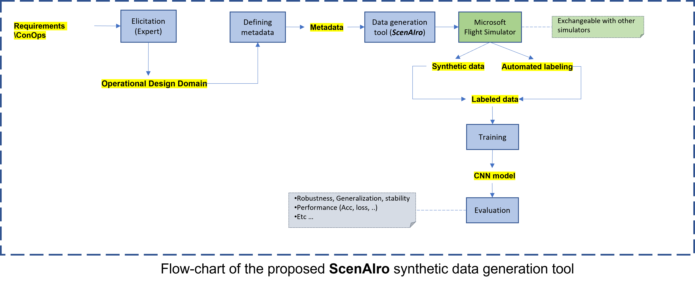
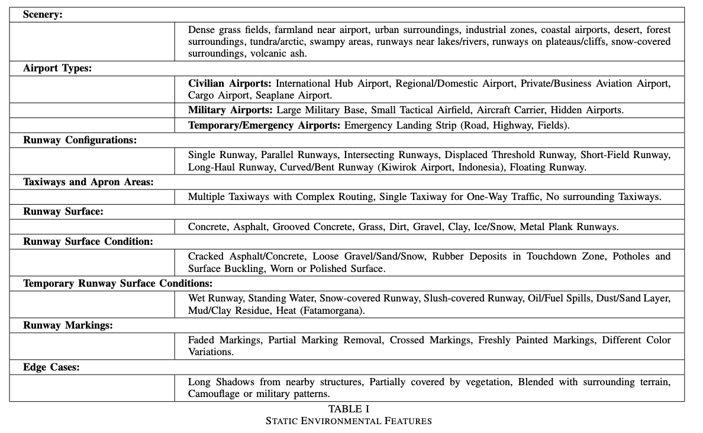
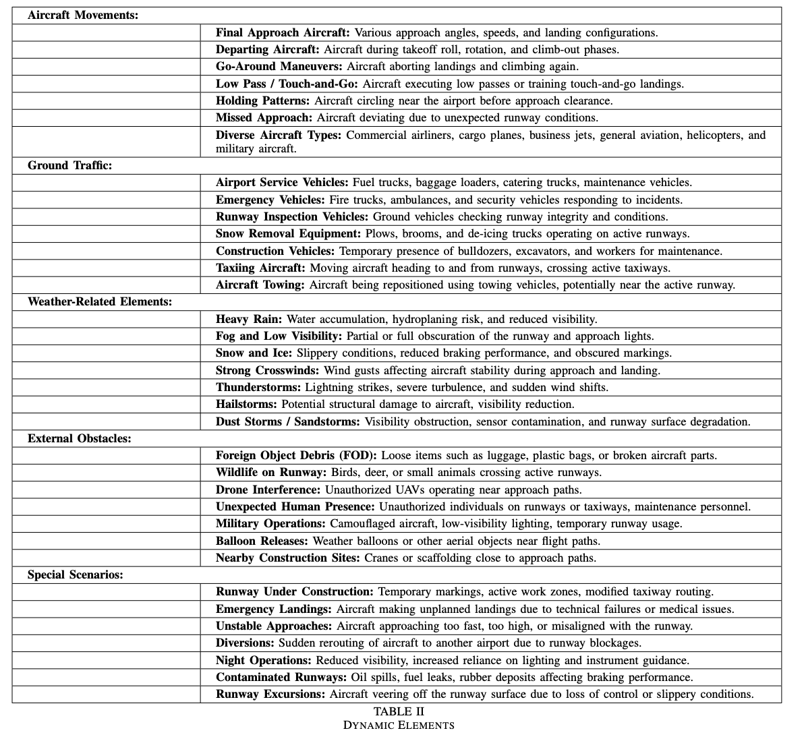
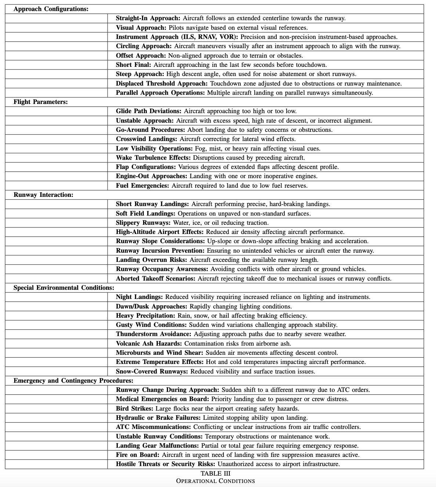
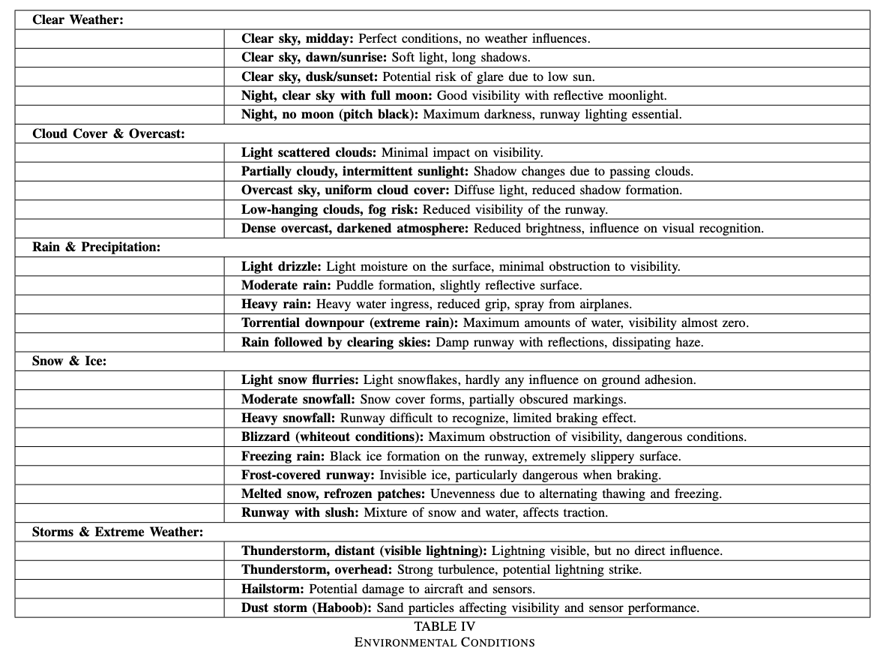
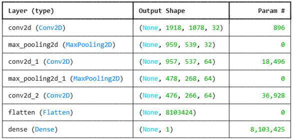

# ScenAIro — An End-to-End Toolchain for ODD-Driven Synthetic Data Generation

<p align="left">
  
  
  
  
  
  <a href="https://doi.org/10.18419/DARUS-5124"></a>
</p>

**ScenAIro** is an end-to-end toolchain for generating high-fidelity, **automatically and deterministically labeled** synthetic datasets from a formally defined **Operational Design Domain (ODD)**. It transforms ODD parameters into geo-referenced landing scenarios, drives Microsoft Flight Simulator (MSFS) via SimConnect to render high-resolution imagery, and produces COCO-compatible annotations by geometric projection of real-world runway geometry — eliminating manual or vision-heuristic labeling while preserving full traceability from requirement to image-level metadata.

The framework is developed at the **Institute of Aircraft Systems (ILS), University of Stuttgart**, and is the reference implementation for the DASC 2025 paper *"From ODD to Data: An End-to-End Toolchain for Synthetic Data Generation — A Case Study on AI-Based Runway Detection."* In that study, a CNN trained **exclusively** on ScenAIro imagery generalized to real-world landing images, demonstrating the practical value of ODD-driven synthetic data for training runway-detection models. See [Validation Results](#validation-results) and [Citation](#citation).

The toolchain controls three orthogonal dimensions of dataset generation:

1. **Environmental conditions** — weather, cloud cover, precipitation, night landings, backlight/glare, and time of day.
2. **Aircraft positioning and trajectory** — spatial position relative to the runway plus approach trajectory, altitude, pitch, and bank.
3. **Distribution of capture points** — controlled statistical sampling in 3D space for balanced coverage of nominal operations *and* safety-critical edge cases.




## Table of Contents

- [Background & Motivation](#background--motivation)
- [Key Features](#key-features)
- [How It Works](#how-it-works)
- [Automatic High-Precision Labeling](#automatic-high-precision-labeling)
- [Traceability](#traceability)
- [Integration and Automation](#integration-and-automation)
- [Project Architecture](#project-architecture)
- [Project Structure](#project-structure)
- [Prerequisites](#prerequisites)
- [Installation](#installation)
- [Microsoft Flight Simulator Setup](#microsoft-flight-simulator-setup)
- [Configuration Files Guide](#configuration-files-guide)
- [Coordinate System & Geometry](#coordinate-system--geometry)
- [Sampling Distributions](#sampling-distributions)
- [Weather Presets](#weather-presets)
- [Application Settings](#application-settings)
- [Usage](#usage)
- [Output Format](#output-format)
- [Regenerating Data from Metadata](#regenerating-data-from-metadata)
- [Case Study: Runway Detection](#case-study-runway-detection)
- [Validation Results](#validation-results)
- [Bridging the Sim-to-Real Gap](#bridging-the-sim-to-real-gap)
- [Dataset & ODD Availability](#dataset--odd-availability)
- [Roadmap](#roadmap)
- [Troubleshooting](#troubleshooting)
- [Related Work](#related-work)
- [Citation](#citation)
- [Contributing](#contributing)
- [License](#license)
- [Acknowledgments & Contact](#acknowledgments--contact)


## Background & Motivation

Integrating machine learning into safety-critical aviation systems raises demands on reliability, traceability, and certifiability that classical assurance standards (DO-178C, ARP4754A) do not directly address, and that ML-specific guidance such as EASA/Daedalean's CoDANN and its extended *W-model* seeks to fill. Two problems dominate in practice:

- **Data scarcity.** Flight data — especially for rare, safety-relevant edge cases (extreme weather, glare, degraded approaches, emergencies) — is expensive, regulated, and often impossible to capture in reality.
- **Traceable ODD coverage.** Existing simulation pipelines typically expose fixed scenario templates, offer limited parameter control, and lack explicit alignment to a formal ODD, making it hard to prove operational coverage or to trace a sample back to its governing requirements.

ScenAIro targets both: it turns an ODD specification into systematically sampled, geo-referenced, annotated scenarios, with every sample linked to the exact configuration that produced it. This supports transparent, verifiable, and reproducible data generation suited to certification-oriented workflows, while remaining a general perception-data tool extensible beyond runway detection.


## Key Features

- **ODD → data, end to end** — from formal ODD parameters to labeled 4K imagery, with no manual annotation step.
- **Deterministic, geometry-based labeling** — runway corners are projected from real WGS84 coordinates through the camera model into pixel space, so labels are **independent of visual conditions** (fog, night, rain never degrade annotation quality). Estimated positional accuracy: **average offset < 1.5 m (~3% of a 45 m runway width)**.
- **Full traceability** — each annotation embeds a configuration reference plus auxiliary metadata (simulation platform, timestamp, software version, author), enabling exact reconstruction of the generating context.
- **Cone-based ODD sampling** — capture points are drawn from a parameterized approach cone (apex, lateral/vertical spread, distance) with selectable statistical distributions per axis.
- **Full 6-DoF aircraft control + environment** — latitude, longitude, altitude, pitch, heading, bank, simulation clock, and weather are set per frame via SimConnect and UI automation. Aircraft position is **injected directly via API**, bypassing simulated GPS drift for high relative accuracy.
- **Interactive GUI *and* headless SDK** — configure and preview scenes visually, or automate large unattended runs programmatically (`ScenAIroSDK`).
- **Reproducible & re-runnable** — datasets can be regenerated deterministically from their metadata sidecars.
- **Simulator-agnostic architecture** — MSFS is used for its geospatial fidelity, but the design accommodates other backends (e.g., X-Plane).
- **Throughput** — ~2.1 s/image in unattended batch mode; the dominant cost is MSFS streaming/rendering, not ScenAIro logic.


## How It Works

ScenAIro implements the first (data-generation) phase of a two-phase, ConOps-guided methodology; the second phase is CNN training/validation on the generated data. For each configured scene, the pipeline executes:

1. **Define the ODD** — select a runway configuration and an approach-cone configuration (apex, spread angles, distance, point count, distribution).
2. **Generate sampling points** — `SamplingPointGenerator` produces an `N × 3` point cloud inside the cone, plus per-point aircraft orientation (pitch/yaw/roll) drawn from configured ranges.
3. **Project to geo-coordinates** — `GeoCoordinateProjector` converts each local `(x, y, z)` point to WGS84 `(lat, lon, alt)` via a geodesic forward calculation relative to the runway center.
4. **Set the environment** — `WeatherAutomationAgent` applies the weather preset; the simulation clock is set to the requested time of day.
5. **Position & capture** — `AircraftPositioningAgent` places the aircraft in MSFS, freezes/pauses the sim for a stable frame, waits for scenery to stream, and captures a high-resolution screenshot.
6. **Project runway corners** — `RunwayGeometryCalculator` + `RunwayCornerAnnotationStruct` express the four corners in the aircraft frame; `RunwayTaggingEngine` rotates by camera attitude and applies a perspective projection to pixel coordinates.
7. **Write labels & metadata** — a COCO annotation plus rich scene metadata is saved alongside the image; optional overlays are burned onto a `tagged_*.png` for inspection.

```
ODD config ─► Sampling points ─► Geo projection ─► Weather + Time ─► Position aircraft
                                                                          │
        COCO label + metadata ◄─ Project runway corners ◄─ Capture screenshot
```


## Automatic High-Precision Labeling

Labeling is a multi-step geometric transformation, entirely independent of pixel content:

1. A **3D point cloud** is generated inside the approach cone in Cartesian space using the configured sampling distributions.
2. Points are transformed into **WGS84** coordinates and aligned to the selected runway via its center point; the aligned points are sent sequentially to the simulator, which positions the aircraft.
3. In parallel, the **four runway corners** are computed in local Cartesian coordinates relative to the runway center. For each sampling point, vectors to the corners are computed and adjusted for the aircraft's expected orientation (pitch, yaw, bank).
4. These vectors are transformed into the **camera coordinate system**, projected onto the image plane with a **perspective projection model**, and converted to **pixel coordinates**.
5. The resulting 2D points form the annotation, stored in **COCO-compatible JSON** alongside the image.

Because the method never relies on visual features, annotation quality is stable across all visibility conditions — a key advantage over CV-heuristic labeling, which degrades under low light, fog, or adverse weather. Positional accuracy was assessed by systematic manual inspection of overlaid corner structures across many scenarios (no analytical ground truth is possible, since MSFS does not publish asset-placement error margins). The observed alignment corresponds to an **average offset below 1.5 m**, roughly **3% of a standard 45 m runway width**.


## Traceability

Traceability is a first-class design goal: every sample — image *and* annotation — is associated with the precise configuration that governed its creation (ODD parameters, sampling distributions, environmental and aircraft settings).

- **Configuration presets** for airport, cone, angles, and time are saved/reloaded as JSON and stored alongside the dataset.
- **Each annotation embeds a configuration reference** so a sample can be traced back to its governing config.
- **Auxiliary metadata** (simulation platform, generation timestamp, software version, author identity) is persisted with standard COCO fields, enabling full reconstruction of the simulation context and supporting reproducible, auditable generation.


## Integration and Automation

ScenAIro drives **Microsoft Flight Simulator** through the **SimConnect** SDK (bundled under [`dependencies/SimConnect/`](dependencies/SimConnect/)) for aircraft state and clock control. Weather is applied through **UI automation** (`WeatherAutomationAgent`), since presets are only exposed via the simulator's on-screen menu. Real-world coordinate references drive fully automated, high-precision annotation without manual labeling. MSFS is the current backend for its visual realism and geospatial accuracy, but the architecture is designed to integrate other simulation platforms.


## Project Architecture

The GUI and the programmatic SDK are interchangeable front-ends over a shared set of backend tools:

```
┌───────────────────────────────────────────────────────────────────┐
│                        ScenAIro Application                        │
├───────────────────────────────────────────────────────────────────┤
│  Front-ends                                                        │
│    ├── main.py ──► ScenAIro.py         (GUI controller, tk.Tk)     │
│    │                   └── presentation/ScenAIroUI.py  (GUI layer) │
│    │                       └── SettingsPopup.py (settings dialog)  │
│    └── ScenAIroSDK.py                  (headless / scripting API)  │
│                                                                    │
│  tools/ (Backend Modules)                                          │
│    ├── SamplingPointGenerator.py     (3D cone point generation)    │
│    ├── RunwayGeometryCalculator.py   (runway corner geometry)      │
│    ├── GeoCoordinateProjector.py     (Cartesian → WGS84 lat/lon)   │
│    ├── AircraftPositioningAgent.py   (SimConnect position + capture)│
│    ├── WeatherAutomationAgent.py     (weather UI automation)       │
│    ├── RunwayCornerAnnotationStruct.py (corner data structures)    │
│    ├── RunwayTaggingEngine.py        (3D→2D projection + COCO)     │
│    ├── MetadataFileReader.py         (regenerate data from JSON)   │
│    └── SettingsManager.py            (persistent configuration)    │
│                                                                    │
│  dependencies/                                                     │
│    └── SimConnect/                   (MSFS SDK integration)        │
└───────────────────────────────────────────────────────────────────┘
```

### Core Components

| Module | Purpose |
|--------|---------|
| [`main.py`](main.py) | Entry point; instantiates `ScenAIro` and runs the GUI event loop |
| [`ScenAIro.py`](ScenAIro.py) | GUI controller (`tk.Tk`); orchestrates preview and the full labeled export loop |
| [`ScenAIroSDK.py`](ScenAIroSDK.py) | Programmatic SDK for headless/scripted generation (can also launch the GUI) |
| [`presentation/ScenAIroUI.py`](presentation/ScenAIroUI.py) | Tkinter GUI: input panels, live 3D preview, distribution/weather controls, config save/load |
| [`tools/SamplingPointGenerator.py`](tools/SamplingPointGenerator.py) | Generates 3D sampling points inside the approach cone with selectable distributions |
| [`tools/RunwayGeometryCalculator.py`](tools/RunwayGeometryCalculator.py) | Computes runway-corner geometry; JSON save/load of airport configs |
| [`tools/GeoCoordinateProjector.py`](tools/GeoCoordinateProjector.py) | Projects local Cartesian points to WGS84 geographic coordinates (`pyproj`) |
| [`tools/AircraftPositioningAgent.py`](tools/AircraftPositioningAgent.py) | Positions the aircraft via SimConnect, controls the clock, captures screenshots |
| [`tools/WeatherAutomationAgent.py`](tools/WeatherAutomationAgent.py) | Automates MSFS weather selection via simulated mouse input |
| [`tools/RunwayCornerAnnotationStruct.py`](tools/RunwayCornerAnnotationStruct.py) | Data structures/transforms for runway-corner annotations in the aircraft frame |
| [`tools/RunwayTaggingEngine.py`](tools/RunwayTaggingEngine.py) | 3D→2D corner projection and COCO annotation writing (+ optional overlays) |
| [`tools/MetadataFileReader.py`](tools/MetadataFileReader.py) | Parses metadata sidecars and regenerates images/labels deterministically |
| [`tools/SettingsManager.py`](tools/SettingsManager.py) | Singleton settings store with JSON persistence and typed accessors |


## Project Structure

```
ScenAIro/
├── main.py                             # Application entry point
├── ScenAIro.py                         # Main application controller (GUI + logic)
├── ScenAIroSDK.py                      # SDK for programmatic data generation
│
├── config/                             # Configuration files
│   ├── time.json                       # Time of day settings
│   ├── angles_test.json                # Test angle configuration
│   ├── JSON_APEX_Config.json           # Apex configuration template
│   ├── Lard Angles.json                # LARD dataset angles
│   ├── zero_orientation.json           # Zero orientation reference
│   │
│   ├── Airports/                       # Airport/runway definitions
│   │   ├── EDDV_9L.json                # Hannover Airport runway 9L
│   │   ├── EDNY_24.json                # Friedrichshafen runway 24
│   │   ├── EDSB_21.json                # Karlsruhe/Baden-Baden Airport runway 21
│   │   ├── ELLX_24.json                # Luxembourg runway 24
│   │   ├── ENBR_35.json                # Bergen runway 35
│   │   ├── KLAX_R25.json               # Los Angeles runway R25
│   │   └── Stuttgart (EDDS).json       # Stuttgart full config
│   │
│   ├── EDDV ANGLES/                    # Approach angle configs for EDDV
│   │   ├── top.json / bottom.json / left.json / right.json
│   │
│   └── KLAX ANGLES/                    # Approach angle configs for KLAX
│       ├── top.json / bottom.json / left.json / right.json
│
├── tools/                              # Core backend modules
│   ├── AircraftPositioningAgent.py     # Aircraft positioning via SimConnect
│   ├── GeoCoordinateProjector.py       # Coordinate transformation
│   ├── MetadataFileReader.py           # Metadata parsing & regeneration
│   ├── RunwayCornerAnnotationStruct.py # Annotation data structures
│   ├── RunwayGeometryCalculator.py     # Runway geometry calculations
│   ├── RunwayTaggingEngine.py          # Automatic runway labeling
│   ├── SamplingPointGenerator.py       # 3D sampling point generation
│   ├── SettingsManager.py              # Settings management
│   ├── SettingsPopup.py                # Settings editor dialog (GUI)
│   ├── WeatherAutomationAgent.py       # Weather automation
│   └── services/                       # Additional services (e.g. SimFrameScout)
│
├── dependencies/                       # Third-party dependencies
│   └── SimConnect/                     # MSFS SimConnect SDK (native DLL + Python wrapper)
│
├── presentation/                       # UI components
│   └── ScenAIroUI.py                   # Tkinter-based GUI
│
├── Generated_Synthetic_Data/           # Output: 4K screenshots + COCO annotations
│
├── docs/                               # Documentation and images
│
├── MSFS_config/                        # Custom ScenAIro aircraft model for MSFS
│   └── ScenAIro_Aircraft/
│
└── LICENSE                             # MIT License
```


## Prerequisites

### Runtime environment
- **Microsoft Flight Simulator 2024** — required for image generation and SimConnect control (the bundled SimConnect wrapper is version-agnostic; the reference study also ran on earlier MSFS builds).
- **Windows** — required (capture, window activation, and mouse automation rely on Windows-only APIs).
- **Python 3.8+** — Python 3.12 was used in the reference setup.

**Reference hardware (dataset generation):** Intel Core i7-13700K, 32 GB DDR4, NVIDIA RTX 4070, Windows 11 Pro. CNN training in the paper used an NVIDIA RTX 6000 Ada. A discrete GPU capable of running MSFS at the target resolution is strongly recommended.

### Python dependencies

| Package | Used for |
|---------|----------|
| `numpy` | Numerical operations, point generation, rotations |
| `pyproj` | WGS84 geodesic coordinate projection |
| `opencv-python` (`cv2`) | Image I/O and overlay rendering |
| `Pillow` (`PIL`) | Screenshot image handling |
| `mss` | Fast, low-latency screen capture |
| `matplotlib` | 3D preview and distribution plots in the GUI |
| `pygetwindow` | Locating/activating the MSFS window |
| `pyautogui` | Weather-menu UI automation |

```bash
pip install numpy pyproj opencv-python Pillow mss matplotlib pygetwindow pyautogui
```

> SimConnect is bundled in [`dependencies/SimConnect/`](dependencies/SimConnect/) (no pip install required). `tkinter` ships with the standard Windows Python installer.


## Installation

```bash
git clone https://github.com/ils-stuttgart/ScenAIro.git
cd ScenAIro
pip install numpy pyproj opencv-python Pillow mss matplotlib pygetwindow pyautogui
```

Next, install the custom **ScenAIro aircraft** in MSFS and set the correct camera view — this is required for correct labeling, since the annotation geometry assumes this aircraft and camera. Follow the full walkthrough in [Microsoft Flight Simulator Setup](#microsoft-flight-simulator-setup).

Finally, set the output directory and capture resolution via the in-app [settings dialog](#application-settings) or `config/settings.json`.


## Microsoft Flight Simulator Setup

This one-time configuration installs the custom **ScenAIro aircraft** and sets the correct camera view, which together guarantee that the automated annotation pipeline produces geometrically correct runway labels.

> **Why this matters:** ScenAIro's labeling projects real-world runway geometry through the aircraft's camera model. The math assumes the ScenAIro aircraft and the specific camera view configured below — using a different aircraft or camera will shift the projected corners and corrupt the labels.

### 1. Enable Developer Mode

1. Start **Microsoft Flight Simulator**.
2. Open **Settings**.
3. Go to **General → Advanced (Developer Mode)** and **activate Developer Mode**.
4. Click **Apply & Save**, then **Back** to return to the main menu.

A **Developer menu bar** now appears at the top of the screen.

### 2. Load the ScenAIro Aircraft Project

1. In the Developer menu bar, open **File → Open project**.
2. Navigate to the ScenAIro repository and select the aircraft **`.xml`** file from `MSFS_config/ScenAIro_Aircraft/`.
3. Once it has loaded, close the project pop-up window.

> **Tip:** After the first load, reopen it faster next time via **File → Open recent**.

### 3. Exit Developer Mode

In the Developer menu bar, go to **DevMode → Exit DevMode**. The developer menu bar disappears and you return to the standard MSFS interface; the ScenAIro aircraft remains available.

### 4. Start a Free Flight with the ScenAIro Aircraft

1. Open **Free Flight**.
2. Click the **aircraft selection** and scroll until you find the **ScenAIro** aircraft, then select it.
3. Select the **airport** of your choice.
4. Start the flight and click **Ready to Fly**.

Once loaded, the aircraft appears as a distinctive **paper-plane–style model** — this confirms the ScenAIro aircraft is active.

### 5. Set the Correct Camera View

This final step is essential for correct annotation.

1. When the flight has started, move the mouse to the **top-center of the screen** to reveal the hover menu.
2. Click the **camera** icon.
3. Select **Cockpit → Pilot**, then in the submenu that opens, select **Pilot** again.

With this camera view active, the aircraft is fully configured. Keep this flight running and the MSFS window visible while ScenAIro generates data — the toolchain repositions this aircraft and captures screenshots through the camera view you just configured.


## Configuration Files Guide

### Airport Configuration (`config/Airports/*.json`)

```json
{
    "airport_name": "Hannover",
    "icao_code": "EDDV",
    "runway": {
        "name": "9L",
        "width": 45.0,
        "length": 3198.0,
        "heading": 92.56987,
        "center_coordinates": {
            "latitude": 52.467599,
            "longitude": 9.676213,
            "altitude": 52.781002
        },
        "start_height": 52.781002,
        "end_height": 51.781002
    }
}
```

`airport_name`, `icao_code`, and `runway.name` are identifiers; `width`/`length` are in meters; `heading` in degrees; `center_coordinates` is the runway center (lat/lon/alt); `start_height`/`end_height` are the threshold-end and far-end elevations (used to model runway slope). Airport files are created/saved/loaded from the GUI or via `RunwayGeometryCalculator.saveAirport()` / `loadAirport()`.

### Approach-Cone Configuration (`config/* ANGLES/*.json`)

```json
{
    "Apex X": "1200",
    "Apex Y": "0",
    "Apex Z": "0",
    "Lateral Angle Left": "-4",
    "Lateral Angle Right": "4",
    "Vertical Min Angle": "3.62",
    "Vertical Max Angle": "3.98",
    "Maximum Distance": "3000",
    "Number of Points": "65"
}
```

`Apex X/Y/Z` is the apex offset from the threshold (m); `Lateral Angle Left/Right` are horizontal cone half-angles (deg, negative = left); `Vertical Min/Max Angle` bound the glide-path angle (deg); `Maximum Distance` is the approach range (m); `Number of Points` is the sample (image) count.

### Time Configuration (`config/time.json`)

```json
{ "Hours": "13", "Minutes": "00" }
```


## Coordinate System & Geometry

ScenAIro uses a right-handed local frame anchored at the runway center, then projects it onto the globe:

- **X** — forward (aligned with runway heading)
- **Y** — lateral (left/right of the runway)
- **Z** — vertical (altitude offset)

Transformation chain: (1) **local generation** — points and corners in the local frame, runway heading applied by 2D rotation; (2) **geodesic projection** — ground distance and azimuth fed to a WGS84 forward calculation (`pyproj.Geod`) for real `(lat, lon)`, altitude offset added; (3) **camera projection** — corners expressed relative to the aircraft, rotated by camera pitch/yaw/roll, projected to pixels via a pinhole/FOV model derived from the configured vertical FOV and aspect ratio.


## Sampling Distributions

Point density inside the cone is configurable per axis, letting you bias coverage toward the operationally relevant parts of the ODD. Set the mode in the GUI or via the SDK's `distribution_type`; apply it independently to X (distance) and/or Y (lateral):

| Mode | Behavior |
|------|----------|
| `Normal Distribution` | Uniform — evenly spread across the range |
| `Parabel` | Beta(0.5, 0.5) "U-shape" — density toward the **edges** |
| `Exponentiell` | Distance axis: exponential falloff, dense near the **apex**; lateral axis: Gaussian, dense in the **center** |

Aircraft orientation (pitch, yaw, roll) is drawn uniformly from the configured min/max ranges per point.


## Weather Presets

Weather is applied before capture by `WeatherAutomationAgent`, which drives the MSFS weather menu via simulated mouse input:

`Clear Skies` · `Few Clouds` · `Scattered Clouds` · `Broken Clouds` · `High Level Clouds` · `Overcast` · `Rain` · `Snow` · `Light Thunderstorm`

> **Calibration required.** Because weather selection is UI automation, the click coordinates in `tools/WeatherAutomationAgent.py` are specific to your **screen resolution and UI scaling**; recalibrate them if presets are not applied correctly. Moving the mouse to a screen corner aborts the automation (PyAutoGUI failsafe).


## Application Settings

Runtime parameters are managed by the `SettingsManager` singleton and persisted to `config/settings.json`. They are editable live through the GUI **Settings** dialog (`SettingsPopup`), with validation and reset-to-defaults.

| Category | Key settings |
|----------|--------------|
| `window` | Main window width/height and background color |
| `paths` | `screenshot_path` (output directory), `config_path` |
| `screen` | Screenshot `width` / `height` (e.g., 3840×2160 for 4K) |
| `camera` | `vertical_fov_radians` (drives the projection model) |
| `ui_layout` | Sidebar widths and plot figure sizes |
| `plot` | Point size, transparency, apex marker size (3D preview) |

> The shipped default `screenshot_path` is a local Windows path — set your own output directory on first run.


## Usage

### GUI mode

```bash
python main.py
```

In the GUI: load a runway config from [`config/Airports/`](config/Airports/) and an angle config from [`config/* ANGLES/`](config/); set output path, resolution, time of day, weather, and distribution; watch the live 3D preview; then click **Generate Data**. The loop iterates every sampling point (set weather/time → position aircraft → capture → project corners → write COCO annotation and optional overlay).

> The GUI runs the export on the main thread and pauses briefly every 20 images to let MSFS release VRAM. Keep the MSFS window visible and unobstructed during capture.

### Programmatic mode (SDK)

All `configure_*` methods return `self`, so calls chain. Aircraft position is injected via the SimConnect API for high relative accuracy.

```python
from ScenAIroSDK import ScenAIroSDK

sdk = ScenAIroSDK()

sdk.configure_airport(
    name="Hannover Airport", icao_code="EDDV", runway_name="09L",
    width=45, length=3198, heading=92.56987,
    latitude=52.467599, longitude=9.676213, altitude=52.781,
    start_height=52.781, end_height=51.781,
)

sdk.configure_point_generation(
    apex=(1200, 0, 0),
    lateral_angle_left=-4, lateral_angle_right=4,
    vertical_min_angle=3.62, vertical_max_angle=3.98,
    max_distance=3000, num_points=65,
    distribution_type="Normal Distribution",  # or "Parabel" / "Exponentiell"
    apply_x=True, apply_y=True,
)

sdk.configure_aircraft_orientation(
    pitch_min=-2, pitch_max=2,
    yaw_min=-3,  yaw_max=3,
    roll_min=-2, roll_max=2,
)

sdk.configure_output(
    screenshot_path="Generated_Synthetic_Data",
    screen_width=3840, screen_height=2160,
)

result = sdk.generate_data(
    weather="Clear Skies",
    enable_labeling=True, enable_overlay=False,
    sim_hour=13, sim_minute=0,
)
print(f"{result['points_generated']} images -> {result['output_path']}")
```

**Other entry points:**

```python
from ScenAIroSDK import quick_generate
result = quick_generate(airport_config, point_config, orientation_config, output_path="out/")

sdk = ScenAIroSDK.from_config_file("config/my_run.json")   # build from saved config
sdk.save_config("config/my_run.json")                       # persist current config
sdk.get_status()                                            # readiness introspection
sdk.launch_gui()                                            # open the GUI from the SDK
```

`generate_data()` accepts a `progress_callback(current, total)` for long unattended runs.


## Output Format

Each data point yields two files.

**Image (`.png`)** — high-resolution screenshot (configurable; e.g., 4K 3840×2160). With overlays enabled, an additional `tagged_*.png` is written with projected corners drawn for verification.

**Annotation (`.json`)** — COCO-compatible bounding box + segmentation, enriched with ScenAIro scene metadata so any image can be regenerated later:

```json
{
    "images": [
        { "file_name": "2025-02-17_120746.png", "id": "2025-02-17_120746.png", "width": 3840, "height": 2160 }
    ],
    "annotations": [
        {
            "id": 0, "image_id": "2025-02-17_120746.png", "category_id": 1,
            "bbox": [1756, 1029, 359, 53],
            "segmentation": [[1903, 1082, 1934, 1082, 1756, 1029, 2115, 1029]],
            "area": 19027, "iscrowd": 0
        }
    ],
    "categories": [ { "id": 1, "name": "runway", "supercategory": "infrastructure" } ],
    "runway_data": {
        "name": "Hannover", "icao_code": "EDDV", "runway_name": "9L",
        "runway_width": 45.0, "runway_length": 3198.0, "runway_heading": 92.56987,
        "runway_center": { "latitude": 52.467599, "longitude": 9.676213, "altitude": 52.781 }
    },
    "landing_approach_cone": {
        "apex": [1200, 0, 0],
        "lateral_angle_left": -4, "lateral_angle_right": 4,
        "vertical_min_angle": 3.62, "vertical_max_angle": 3.98,
        "max_distance": 3000, "number_of_points": 65,
        "distribution": { "type": "Normal Distribution", "apply_x": true, "apply_y": true }
    },
    "position_of_aircraft": [52.4610, 9.6512, 152.4],
    "distance_aircraft_2_runway": { "ground_distance_in_meters": 2814.55, "altitude_difference_in_meters": 176.2 },
    "aircraft_orientation": { "pitch": 1.2, "yaw": -0.8, "roll": 0.4 },
    "daytime": { "hours": 13, "minutes": 0 },
    "weather": "Clear Skies"
}
```

> The extra top-level keys (`runway_data`, `landing_approach_cone`, `position_of_aircraft`, `distance_aircraft_2_runway`, `aircraft_orientation`, `daytime`, `weather`) are ScenAIro extensions supporting traceability; standard COCO consumers can ignore them.


## Regenerating Data from Metadata

Because every image carries a complete metadata sidecar, whole datasets can be **regenerated deterministically** from a folder of JSON files via `MetadataFileReader` — useful for re-rendering at higher resolution, re-shooting under corrected conditions, or reproducing a dataset on another machine.

```python
from tools.MetadataFileReader import MetadataFileReader

reader = MetadataFileReader(file_path=None, screenshot_dir="Generated_Synthetic_Data")
images, jsons = reader.process_folder(
    "Generated_Synthetic_Data",
    use_sim=True,      # reposition aircraft in MSFS and recapture
    set_weather=True,  # re-apply the weather recorded in each metadata file
)
```

`process_folder` only changes weather when it differs between consecutive scenes (avoiding redundant menu automation) and rebuilds both imagery and COCO annotations.


## Case Study: Runway Detection

Runway detection during final approach/landing of fixed-wing aircraft is the reference use case. The ODD definition follows three steps: (1) identify relevant environmental/operational/dynamic parameters; (2) prioritize by safety relevance; (3) assess probability/rarity to ensure edge-case coverage. **Over 250 parameters** were identified across four categories — *Static Environmental Features, Dynamic Elements, Operational Conditions, Environmental Conditions* — spanning diverse airports, runway layouts, surface states, traffic and ground vehicles, weather from ideal daylight to dust storms/freezing rain/night landings, and operational variations such as offset approaches and go-arounds.

### ODD tables






### Landing approach cone

Sampling is confined to a realistic approach corridor defined by lateral/vertical angle limits, maximum approach distance, and apex position. Representative case-study parameters: airports Stuttgart (EDDS), Zurich (LSZH), Munich (EDDM), Rome (LIRF), Lille (LFQQ); distance to runway 0.1–5.56 km; vertical angle 2.2–3.8°; lateral deviation −4–4°; time of day from 1 h before sunrise to 1 h after sunset in 30-min steps; light/weather across Clear/Clouds/Rain/Backlight/Sunrise/Sunset.

### Generated dataset

The generated synthetic dataset consists of high-resolution **4K images** with corresponding COCO annotation files. Labels are computed geometrically and remain consistent across all visibility conditions; overlays can be rendered for manual QA.

<p align="center">
     <strong>Sample images from the ScenAIro dataset</strong><br>
    
    
     <br>
    
    
</p>

### CNN model

A compact CNN (two conv + max-pool blocks, flatten, dense) is trained on the ScenAIro dataset to detect/classify runways, learning spatial features that distinguish runways from other terrain.

<p align="center">
    <strong>CNN architecture for the runway detection application</strong><br>
    
</p>


## Validation Results

To assess real-world transferability, a compact CNN was trained **exclusively on ScenAIro-generated imagery** and then evaluated on real-world landing images within the ODD. The model reached **100% accuracy on the synthetic training and validation sets** and **62% accuracy on the real images**, indicating that a network trained purely on ScenAIro data transfers to real-world scenarios — even though the inputs were downscaled for evaluation. This supports the effectiveness of ODD-driven synthetic data for producing diverse, realistic operational conditions and edge cases.

Additional findings:

- **Annotation accuracy** — average positional offset **< 1.5 m (~3% of a 45 m runway width)**, from systematic manual inspection of overlaid corners.
- **Throughput** — **~2.1 s/image** on average in unattended batch mode; the bottleneck is MSFS network fetch + rendering, not ScenAIro logic.

> These results are a proof of concept demonstrating the practical value of ODD-driven synthetic data, not a claim of production-grade detection accuracy. Full experimental details are available in the paper (see [Citation](#citation)).


## Bridging the Sim-to-Real Gap

Because MSFS already provides photorealistic visuals, the effort focuses on minimizing **semantic** (rather than image-quality) discrepancies. The framework incorporates — partly implemented, partly on the roadmap — the following strategies:

- **Semi-lossless real-world mapping.** *Target airport selection* fixes static ODDs (runway config, surface, layout, surroundings). *Real-world distribution extraction* mines operational data (trajectories, weather, wind, sun position) from public aviation/meteorological sources (e.g., the Flightradar24 API, with historical data back to 2016). *Inner ODD parameter distribution* fits probabilistic distributions from that data to guide sampling while preserving real-world statistics.
- **Accident data.** Historical incident/accident reports surface failure-prone ODD combinations (e.g., low-visibility approaches in complex terrain, crosswinds at short runways) to enrich high-risk scenario generation.
- **Expert knowledge.** Input from pilots, safety professionals, and regulators prioritizes rare-but-safety-relevant edge cases that may not be statistically dominant.


## Dataset & ODD Availability

- **Full ODD listing** — distributed with the framework in this repository.
- **Generated datasets** — published on DaRUS: **[https://doi.org/10.18419/DARUS-5124](https://doi.org/10.18419/DARUS-5124)**.


## Roadmap

Planned/ongoing directions from the reference work:

- Expand the ODD parameter space to broader environmental and aircraft configurations.
- Extend beyond runway detection to perception tasks such as obstacle avoidance and autonomous navigation.
- Incorporate statistical ODD distributions derived from real flight data, accident reports, and expert knowledge.
- Integrate domain knowledge via **ontology-based** methodologies for richer, context-aware data.
- Investigate **transfer learning** (adapting the network's final layer) to further close the sim-to-real gap.


## Troubleshooting

| Issue | Resolution |
|-------|-----------|
| SimConnect connection fails | Ensure MSFS is running and the ScenAIro aircraft is selected before launching ScenAIro |
| MSFS window not found | Confirm the window title is "Microsoft Flight Simulator" and the window is open (not minimized) |
| No screenshots captured | Verify the configured `screenshot_path` exists and is writable |
| Aircraft doesn't move | Confirm the ScenAIro aircraft is loaded — some default aircraft ignore SimConnect position writes |
| Wrong/no weather applied | Recalibrate `WeatherAutomationAgent` click coordinates for your resolution and UI scaling |
| Runway corners mislabeled | Check the airport JSON center coordinates, heading, and dimensions |
| Blurry / half-loaded scenery | Increase the pre-screenshot delay so terrain/textures can stream before capture |

The pipeline logs each positioning, capture, and annotation step (`[INFO]`/`[WARN]`/`[ERROR]`). Enable overlay labeling to visually confirm corner projection on `tagged_*.png`, and validate configs by loading them in the GUI before large runs.


## Related Work

- **LARD** — Ducoffe et al., *LARD: Landing Approach Runway Detection dataset for vision-based landing*, arXiv:2304.09938, 2023. [DOI](https://doi.org/10.57745/MZSH2Y)
- **Daedalean** — hybrid synthetic + manually annotated real flight data. [Dataset](https://rosap.ntl.bts.gov/view/dot/62210/dot_62210_DS1.pdf)
- **Acubed (Airbus Wayfinder)** — hybrid real-world collection + controlled synthetic generation.

Relative to these, ScenAIro emphasizes *formal ODD alignment*, *fully automated geo-referenced labeling*, *systematic edge-case coverage*, *traceability*, and an *open-source, simulator-agnostic* design.


## Citation

If you use ScenAIro in academic work, please cite the paper and the dataset.

```bibtex
@inproceedings{gattnar2025scenairo,
  author       = {Gattnar, Saymon R. and Sp{\"a}th, Henry and Akhiat, Yassine and Daw, Zamira},
  title        = {From {ODD} to Data: An End-to-End Toolchain for Synthetic Data Generation --
                  A Case Study on {AI}-Based Runway Detection},
  booktitle    = {2025 IEEE/AIAA 44th Digital Avionics Systems Conference (DASC)},
  year         = {2025},
  organization = {IEEE}
}

@dataset{gattnar2025scenairo_dataset,
  author    = {Gattnar, Saymon and Sp{\"a}th, Henry and Akhiat, Yassine},
  title     = {{ScenAIro}: Synthetic Data Generation -- A Case Study on AI-Based Runway Detection},
  year      = {2025},
  publisher = {DaRUS},
  doi       = {10.18419/DARUS-5124},
  url       = {https://doi.org/10.18419/DARUS-5124}
}
```


## Contributing

Contributions and feedback are welcome. Fork the repository, create a feature branch, and open a pull request. For bugs, questions, or feature proposals, open an issue on GitHub.


## License

Released under the [MIT License](https://github.com/ils-stuttgart/ScenAIro/blob/main/LICENSE).


## Acknowledgments & Contact

Developed at the **Institute of Aircraft Systems (ILS), University of Stuttgart**.
Authors: Saymon R. Gattnar, Henry Späth, Yassine Akhiat, Zamira Daw.
For inquiries, open an issue on the [GitHub repository](https://github.com/ils-stuttgart/ScenAIro) or contact the corresponding author.
